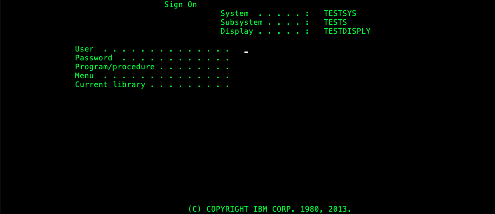
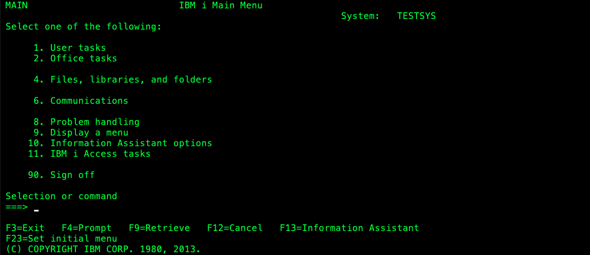

# IBM AS/400 ISeries MCP Server

This project implements a customizable MCP server to execute RTE protocol.

## Example






## Development

### Requirements

* *Java 21+**

### Run

* Compile project `./mvnw clean package`
* Run server on **SSE** mode

    ```bash
    java -jar target/rte-mcp-server-0.0.1-SNAPSHOT.jar
    ```
* Run server on **STDIO** mode

    ```bash
    java -jar -Dspring.ai.mcp.server.stdio=true rte-mcp-server-0.0.1-SNAPSHOT.jar
    ```

### RteUtils

The intention of this project is to be easily extensible. You can add your own MCP tools by
using `RteUtils` class.

Also is needed to define the RTE connection parameters and the RTE flow in a **yaml** format.

`RteUtils` has the following methods implemented:

* `static RteProtocolClient connect(RteConfig config)`: Connects to the RTE server using the
  provided **yaml**.
* `static String executeSteps(RteProtocolClient client, List<RteStep> steps)`: Executes the provided
  steps on the RTE server and returns the screen result as a string using the provided **yaml**.

The method exposed as MCP tool should be annotated as `@Tool` and the class should be annotated as `@Services` like in the
followig example:

```java

@Service
public class RteServiceLoginTool implements RteTool {

  private static final Logger logger = LoggerFactory.getLogger(RteServiceLoginTool.class);

  @Tool(description = "Execute an RTE transaction in a given server", name = "TN5250 Login")
  public String executeRteTransaction(String server, int port) {
    try {
      RteFlow flow = RteYamlLoader.load("/flow.yaml");
      RteProtocolClient client = RteTool.connect(flow.getConfig(), server, port);
      return RteTool.executeSteps(client, flow.getSteps());
    } catch (IOException | RteIOException | InterruptedException | TimeoutException e) {
      logger.error("Error executing RTE flow", e);
      return "Error executing RTE flow: " + e.getMessage();
    }
  }
}
```

The **yaml** defines the connection parameters and the steps to execute in the RTE server. This *
*yaml** file should have the following structure

```yaml
config:
  server: localhost
  port: 2324
  protocol: TN5250
  terminalType: 'IBM-3477-FC: 27x132'
  sslType: None

steps:
  - actions:
      - label: User
        input: TESTUSR
      - label: Password
        input: TESTPSW
    attentionKey: ENTER
```

Any number the steps can be defined in the **yaml** file.

* **server:** The server address to connect to the RTE server.
* **port:** The port to connect to the RTE server.
* **protocol:** The supported protocols are **TN5250**, **TN3270** and **VT420**
* **terminalType:** The following table shows the supported terminal types for each protocol:

  | Protocol | Terminal Type         |
    |----------|-----------------------|
  | TN5250   | IBM-3477-FC: 27x132   |
  |          | IBM-3179-2: 24x80     |
  | TN3270   | IBM-3278-M2: 24x80    |
  |          | IBM-3278-M2-E: 24x80  |
  |          | IBM-3278-M3: 32x80    |
  |          | IBM-3278-M3-E: 32x80  |
  |          | IBM-3278-M4: 43x80    |
  |          | IBM-3278-M4-E: 43x80  |
  |          | IBM-3278-M5: 27x132   |
  |          | IBM-3278-M5-E: 27x132 |
  | VT420    | VT420-7: 24x80        |

* **sslType:** The supported ssl types are **None** **TLS** and **SSLv3**.
* **steps:** A list of actions representing the steps to execute in the RTE server.
* **actions:** All the actions to execute in the current screen, any number of pairs **label/input**
  could be added.
  * **label:** The label of the field to fill in the RTE screen.
  * **input:** The value to fill in the field.
  * **attentionKey:** The key to press after filling the fields, it can be **ENTER**, **F1**,
    **F2**, **F3**, **F4**, **F5**, **F6**, **F7**, **F8**, **F9**, **F10**, **F11**,
    **F12**, **F13**, **F14**, **F15**, **F16**, **F17**, **F18**, **F19**, **F20**, **F21**,
    **F22**, **F23**, **F24**, **ATTN**, **CLEAR**, **SYSRQ**, **RESET**, **ROLL_UP**,
    **ROLL_DN**, **PA1**, **PA2** or **PA3**.

## Testing

An example of integration test is provided in the `RteServiceLoginToolTest` class, this test uses
the `MCPClient` validate the list of tools and execute it.

*note: to test the behaving of to tool is recommended to generate a dump of the RTE flow to be
executed and mock it using [wiresham](https://github.com/abstracta/wiresham)*

More information on how to test and debug the server could be found [here](https://modelcontextprotocol.io/docs/tools/debugging)